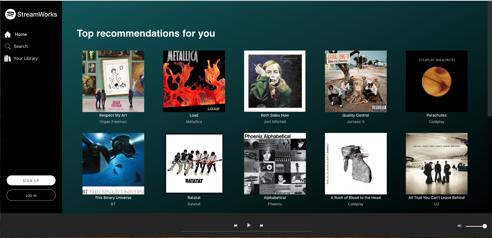
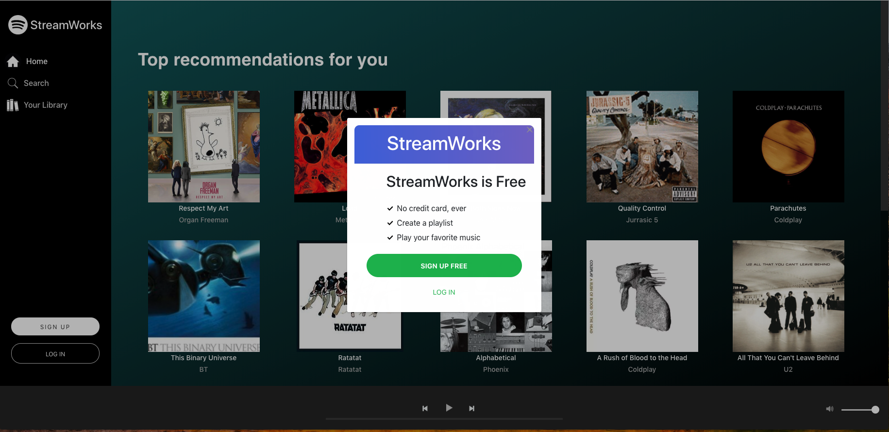
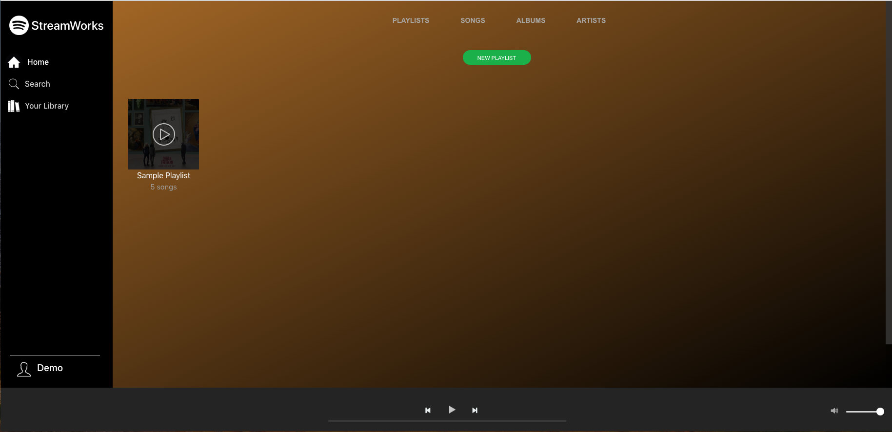
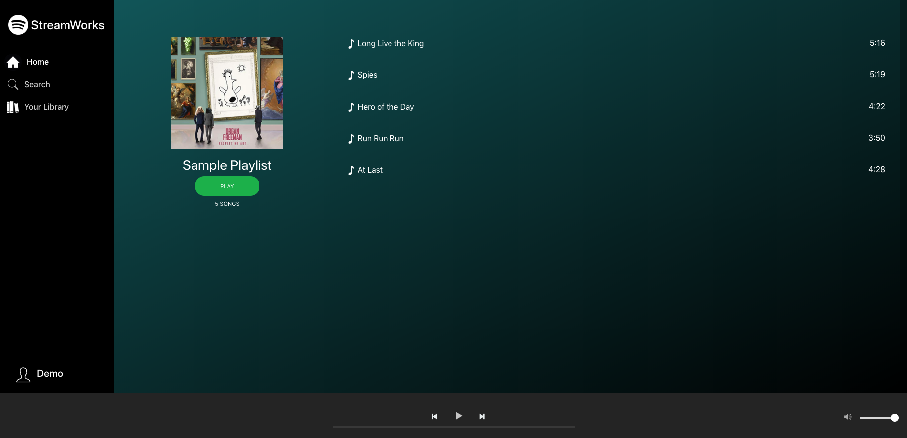
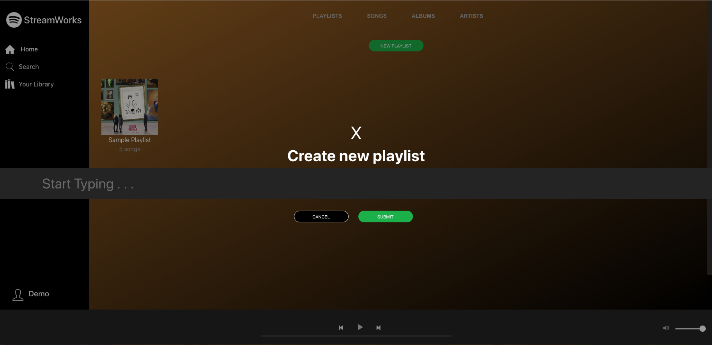

# StreamWorks

StreamWorks is a music streaming web app inspired by Spotify.

Please visit the live site [here](http://streamworks.herokuapp.com/)



## Technologies:

- JavaScript
- React
- GraphQL
- MongoDB
- Redux

## Functionality

### Sign In/ Sign Up / Demo User

Users are able to sign in, sign up, or use the demo user account to browse the site.



## Music Library

Users can add music to their library.



## Playlist

Users can create a playlist




## Code Snippet

#### AudioPlayer.js

```
import React, { Component } from "react";
import "./AudioPlayer.css";
import { Query } from "react-apollo";
import AWSSoundPlayer from "./AWSSoundPlayer";
import { IS_LOGGED_IN } from "../graphql/queries";

import PlaceHolderPlayer from "./PlaceHolderPlayer";

class AudioPlayer extends Component {
  constructor(props) {
    super(props);
    this.nextTrack = this.nextTrack.bind(this);
    this.prevTrack = this.prevTrack.bind(this);
    this.togglePlay = this.togglePlay.bind(this);
  }

  togglePlay() {
    this.props.togglePlay();
  }

  nextTrack() {

    let currentTrack = this.props.state.currentTrack;
    currentTrack += 1;
    this.props.selectTrack(currentTrack);
  }

  prevTrack() {
    let currentTrack = this.props.state.currentTrack;
    currentTrack -= 1;
    if (currentTrack < 0) currentTrack = 0;
    this.props.selectTrack(currentTrack);
  }

  render() {
    let track;
    if (this.props.state.playQueue.length > 0) {

      track = this.props.state.playQueue[this.props.state.currentTrack];
    }

    track = track || {
      stream_url:
        "https://s3.us-east-2.amazonaws.com/streamworks-songs/Respect+My+Art/Long+Live+the+King+1.m4a",
      trackTitle: "Long Live the King",
      artistName: "Organ Freeman",
      albumArtUrl: "https://m.media-amazon.com/images/I/81mBzkImdvL._SS500_.jpg"
    };
    return (
      <Query query={IS_LOGGED_IN}>
        {({ data }) => {
          if (data.isLoggedIn && this.props.state.currentTrack != null) {
            return (
              <div id="audio-player-bar">
                <AWSSoundPlayer
                  id="audio-player"
                  streamUrl={track.stream_url}
                  trackTitle={track.trackTitle}
                  artistName={track.artistName}
                  albumArtUrl={track.albumArtUrl}
                  prevTrack={this.prevTrack}
                  nextTrack={this.nextTrack}
                  togglePlay={this.togglePlay}
                  state={this.props.state}
                  selectTrack={this.props.selectTrack}
                  setCurrentTrack={this.props.setCurrentTrack}
                />
              </div>
            );
          } else {
            return (
              <div id="audio-player-bar">
                <PlaceHolderPlayer loggedIn={data.isLoggedIn} />
              </div>
            );
          }
        }}
      </Query>
    );
  }
}

export default AudioPlayer;
```

### Bonus

- Filter by artist/song/album
- Search bar
- Add to playlist/library

## Collaborators

#### Trevor Steer

#### Shannon Piesinger

#### Koy Saeteurn
